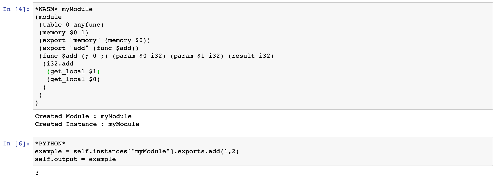
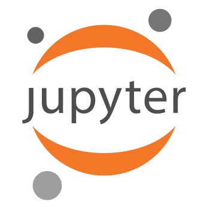

# Wasmer Jupyter Kernel
---
## Project Description
A Jupyter kernel for compiling WebAssembly modules. Implemented using the Wasmer Python library, WebAssembly Binary Toolkit, and IPython Kernel. The motivation for the project is to be able to utilize WebAssembly within Jupyter notebooks as well as have cross language capabilities between WebAssembly and Python. This is achieved using the Wasmer Python library as well as extending the IPython kernel.

## Requirements

 * Python 3

 * Jupyter

 * iPykernel

### WebAssembly Binary Toolkit (Wabt)
[WebAssembly Binary Toolkit](https://github.com/WebAssembly/wabt) is required for the compilation of WebAssembly code. After installing the binary toolkit, make sure it is in your PATH. If you install from source, add the /bin/ folder to your PATH:

```sh
export PATH=$PATH:/.../wabt/bin
```

[Wasmer Python package](https://pypi.org/project/wasmer/) 

```sh
pip install wasmer
```

## Installation
Once your system has the requirements - navigate to the combinedWasmerKernel folder and add the kernel to jupyter.

```sh
$ cd combinedWasmerKernel
$ jupyter kernelspec install wasmerKernel
```

## Basic Usage
Screenshots from an example notebook have been provided to show some use cases.
 

in the above image we demonstrate the ability to create a function in WebAssembly, and call that function within python. To differentiate between WebAssembly code and Python code, headers are used to identify the language. \*WASM* is used for WebAssembly and \*PYTHON* is used for Python.

To access created WebAssembly modules, the modules are stored in a dictionary called ```self.instances``` where the key is the module name, and the value is an instance of the WebAssembly module. To access exported functions within a module, you would access them like so:

```
self.instances["module_name"].exports.function_name(input_params)
```

to print output of a cell, assign output to ```self.output```

## Resources and Credits

This project is a final project for the course COMP SCI 4TB3 / 6TB3 Syntax-Based Tools and Compilers at McMaster University. 

Authors:

* Jakub Pawlikowski
* Anthony Mella
* Tyler Philips

<br>

<div align="center">

  <a href="https://wasmer.io" rel="noopener noreferrer">
    
  </a>
  
  <a href="https://webassembly.org/" rel="noopener noreferrer">
    
  </a>
  
  <a href="https://jupyter.org/" rel="noopener noreferrer">
    
  </a>

</div>